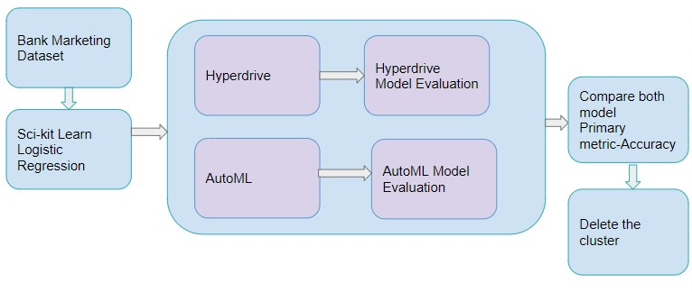
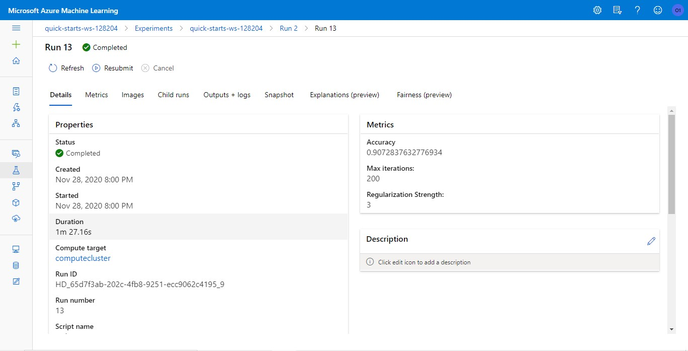
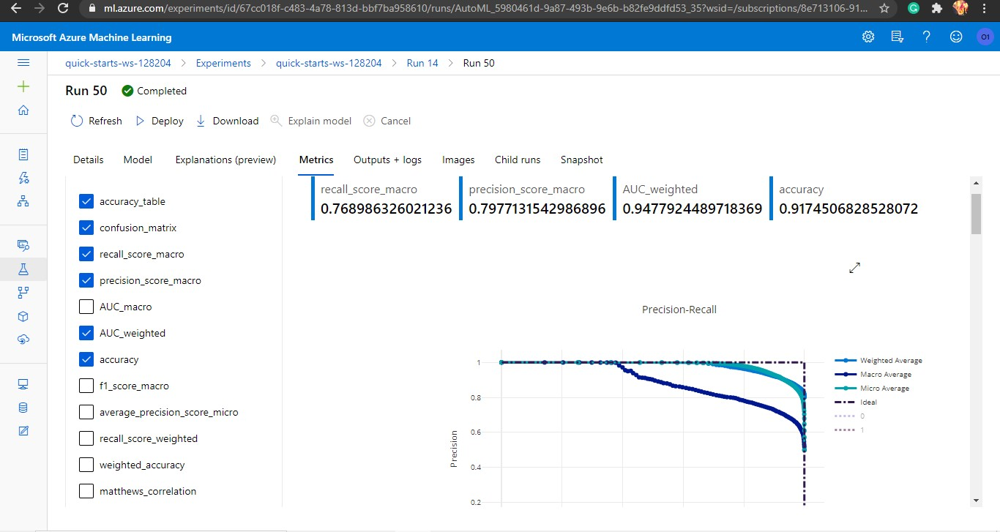
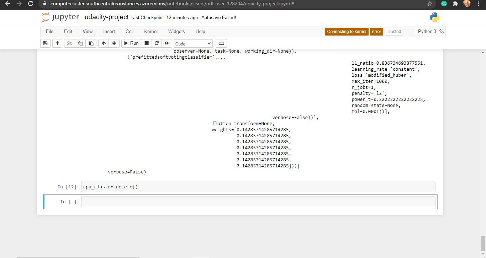

# Optimizing a ML Pipeline in Azure

## Overview
This project is part of the Udacity Azure ML Nanodegree. In this project, we build and optimize an Azure ML pipeline using the Python SDK and a provided Scikit-learn model. This model is then compared to an Azure AutoML run.

## Summary

The provided dataset is a Bank Marketing dataset. We have to predict whether a client subscribed a term deposit or not. The target column is 'y'. We were provided with a custom coded model-a sci-kit learn Logistic Regression. At first, the hyperparameters are tuned using the tool Hyperdrive. We save the best model obtained through this. Next, using Automated Machine Learning(AutoML) an optimal model is determined. We then compare both the results and find out which method gives better results. The best model was VotingEnsemble which gave an accuracy of 0.91745.

## Scikit-learn Pipeline

At first the train.py file was uploaded to the Notebooks in Azure. Then the Bank Marketing dataset was uploaded using the URL provided. The dataset is split into train(80%) and test(20%) data. After that, the Logistic Regression Model was used for training the dataset based on hyperparameters such as -c(Inverse of Regularization Strength) and -max_iter(Maximum number of iterations to converge).

Hyperparamters can be discrete or continuous. Discrete parameters are specified as a choice among dicrete values. Continuous hyperparameters are specified as a distribution over a range of values. I chose 'choice' for describing the values of -C and -max_iter. The sampling method I used in RandomSampling. It supports both discrete and continuous values. It supports early termination of low-performance runs. In Random Sampling, the values are selected randomly from a defined search space.

With the help of Early Termination policy, we can terminate poorly performing runs. The policy that I chose is BanditPolicy. Bandit Policy is based on slack factor/slack amount and evaluation interval. This policy will terminate runs whose primary metric is not within the specified slac factor/slack amount. By using this policy we could improve the computational efficiency.

The best model obtained was saved.The accuracy obtained through Hyperdrive run is 0.907283.

## AutoML

Automated Machine Learning, often referred to as AutoML is the process of automating the entire Machine Learning pipeline. The AutoMLConfig class is used specify paramters such as experiment_timeout_minutes(set as 30 min), task(classification),primary_metric(accuracy), training_data(df), label_column_name(y-whether cliemt makes term deposit or not), n_cross_validations(set as 5).

The best model obtained through AutoML is VotingEnsemble. It had an accuracy of 0.91745. The value of AUC weighted was 0.94779,recall_score_macro was 0.7689, precision_score_macro was 0.797713. The value of hyperparamaters for VotingEnsemble were max_iter = 1000, n_jobs =1, power_t = 0.222222, tol=0.0001. The weights were [0.14285714285714285, 0.14285714285714285,0.14285714285714285,0.14285714285714285,0.14285714285714285,0.14285714285714285,0.14285714285714285]

## Pipeline comparison

The accuracy obatined through hyperdrive run is 0.907283. Whereas, the accuracy obtained through AutoML 0.91745(VotingEnsemble). In hyperdrive, we chose a model, here in this case Logistic Regression. We were only able to tune the hyperparameters with different values. Whereas, in case of AutoML, different models were used. As of result of this, we were able to choose the best performing model instead of sticking to just one type.

## Future work

Some of the imporvements that could be done are:

(a) We could improve the Parameter sampler, so that more values of hyperparameters could be included.

(b) We could try using other Early Termination policy, or optimize the current one to get better results.

(c) We could make sure that the data is cleaned more efficiently, or include more features. This would help us to analyse the data more.

(d) For AutoML, we could change the number of cross validations and see if we get a better model or better accuracy.

(e) We could make use of other classification algorithms i hyperdrive run and understand the difference in the model behaviour.

## Proof of cluster clean up

## References

[Tune Hyperparameters for your model with Azure Machine Learning](https://docs.microsoft.com/en-us/azure/machine-learning/how-to-tune-hyperparameters)

[HyperDriveRunConfig Class](https://docs.microsoft.com/en-us/python/api/azureml-train-core/azureml.train.hyperdrive.hyperdriverunconfig?view=azure-ml-py)

[What is Automated Machine Learning](https://docs.microsoft.com/en-us/azure/machine-learning/concept-automated-ml)

[Configure Automated ML Experiments in Azure](https://docs.microsoft.com/en-us/azure/machine-learning/how-to-configure-auto-train)

[AutoMLConfig Class](https://docs.microsoft.com/en-us/python/api/azureml-train-automl-client/azureml.train.automl.automlconfig.automlconfig?view=azure-ml-py)

[Udacity Mentor Help](https://github.com/Azure/MachineLearningNotebooks/blob/a039166b901b90b6fa5a364c728aca7936e3789d/how-to-use-azureml/ml-frameworks/scikit-learn/train-hyperparameter-tune-deploy-with-sklearn/train-hyperparameter-tune-deploy-with-sklearn.ipynb)

[Udacity Mentor Help](https://knowledge.udacity.com/questions/391409)

